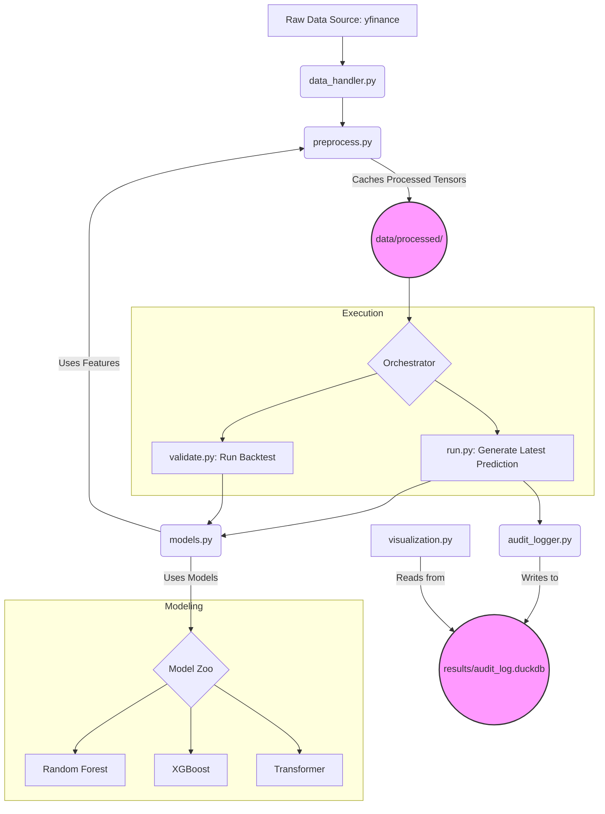

# Finance-Limited INTelligence

## Whitepaper: The "Flint" Algorithmic Analysis Pipeline

**A Modern, End-to-End Framework for Quantitative Strategy Development and Validation**

**Version:** 2.0 | **Date:** July 7, 2025 | **Status:** Active Development

### **Abstract**

The "Flint" project is a sophisticated, end-to-end MLOps pipeline designed for the rigorous development, backtesting, and deployment of quantitative trading strategies. Moving beyond simple scripting, Flint provides a modular, reproducible, and scalable framework that integrates intelligent data caching, advanced feature engineering, and a multi-model validation system. By leveraging a suite of analytical techniques—from classical technical indicators and GARCH volatility forecasting to state-of-the-art Transformer deep learning models—the pipeline delivers a robust, data-driven assessment of a strategy's viability. This paper details the architecture, methodologies, and key findings of the Flint pipeline, demonstrating its efficacy in identifying a performant Random Forest model with **69.22% out-of-sample accuracy** through a rigorous walk-forward validation process, while also highlighting the critical role of such validation in model selection.

---

### **1. Introduction: The Challenge of Algorithmic Alpha**

In the domain of quantitative finance, the pursuit of "alpha"—a consistent, market-beating edge—is fraught with challenges. Many retail and boutique efforts fail not due to a lack of ideas, but due to a lack of a robust engineering and validation framework. Common pitfalls include lookahead bias, overfitting, failure to account for market regimes, and an inability to reproduce results.

The Flint pipeline was engineered to solve these problems. It is not merely a collection of scripts, but a cohesive system built on modern MLOps principles. Its primary objective is to provide a reliable answer to the most critical question: **"Does this trading idea have a persistent, verifiable edge?"**

**Key Architectural Pillars:**
*   **Modularity:** Each component of the pipeline (data handling, feature engineering, modeling, validation) is encapsulated in its own Python module, promoting maintainability and independent development.
*   **Reproducibility:** All analysis runs are logged in a dedicated audit database, capturing the exact code version (via Git hash), model configurations, and results, ensuring any finding can be perfectly reproduced.
*   **Efficiency:** Intelligent caching mechanisms for both raw data and processed feature tensors drastically reduce redundant computation, enabling rapid iteration.
*   **Robustness:** The framework culminates in a gold-standard **walk-forward validation** engine, providing a realistic and trustworthy measure of a strategy's out-of-sample performance across diverse market conditions.

---

### **2. System Architecture: A Tour of the Flint Pipeline**

The Flint project is comprised of a series of interconnected Python modules, each with a distinct responsibility.

#### **Module Breakdown:**

*   **`run.py` (Orchestrator):** The primary entry point for generating a single, up-to-the-minute prediction. It orchestrates the loading of pre-processed data and the execution of a chosen production model.
*   **`validate.py` (The Truth Engine):** The cornerstone of the framework. This script performs a rigorous walk-forward backtest of a specified modeling strategy over a user-defined historical period. It is the ultimate arbiter of a strategy's historical performance and trustworthiness.
*   **`preprocess.py` (Efficiency Core):** Handles the computationally expensive tasks of data loading, feature calculation, and time-series sequencing. It intelligently caches the final, model-ready tensors to disk, allowing both `run.py` and `validate.py` to execute with maximum speed.
*   **`data_handler.py` (Data Ingestion):** An intelligent wrapper around the `yfinance` library. It maintains a local Parquet-based cache for historical price data, only downloading new data since the last run, ensuring minimal API calls and fast startup times.
*   **`feature_engineering.py` (Signal Generation):** A powerful class-based module that calculates a rich tapestry of over 20 quantitative features. This is where the raw data is transformed into meaningful predictive signals.
*   **`models.py` (The Model Zoo):** Defines, trains, and "bulletproofs" the machine learning models. It currently houses an `XGBClassifier`, a `RandomForestClassifier`, and a state-of-the-art `StockTransformer` deep learning model complete with positional encoding and regularization.
*   **`predictors.py` (Advanced Forecasting):** Implements an independent `MonteCarloTrendFilter`. This sophisticated model uses jump-diffusion simulations and Gaussian Processes to provide an orthogonal, forward-looking forecast of trend strength, which can be used as a feature or a standalone signal.
*   **`audit_logger.py` (The Scribe):** Manages a high-performance DuckDB database for logging every detail of each analysis run, providing a complete and queryable audit trail for research and compliance.
*   **`visualization.py` (The Lens):** A Dash-based interactive web application that reads from the audit log to provide a rich visual analysis of model performance, including price charts with buy/sell signals, feature importance plots, and Monte Carlo distributions.
*   **`config.py` (Control Panel):** A centralized configuration file that holds all system parameters, from feature lists and date ranges to model hyperparameters, allowing for easy tuning and experimentation.

---

### **3. Analytical Methodologies**

The Flint pipeline employs a multi-disciplinary approach to market analysis, combining classical techniques with modern machine learning.

#### **3.1 Feature Engineering & Signal Processing**

The pipeline generates a comprehensive feature set designed to capture different aspects of market dynamics:
*   **Trend & Momentum:** Relative Strength Index (RSI), Moving Average Convergence Divergence (MACD), Rate of Change (ROC).
*   **Volatility:** Average True Range (ATR), Bollinger Bands, and a **GARCH(1,1)** model to forecast next-day volatility.
*   **Volume & Flow:** On-Balance Volume (OBV), Money Flow Index (MFI).
*   **Market-Relative Strength:** The RSI and daily return of a market index (e.g., SPY) are incorporated to provide crucial context on the broader market environment.
*   **Cyclicality:** A **Fast Fourier Transform (FFT)**-based analysis on a rolling window is used to determine the `Dominant_Period` of the price series, identifying if the asset is trending or mean-reverting.

#### **3.2 Machine Learning Models**

Flint is designed to be model-agnostic, but currently validates three powerful archetypes:
1.  **Random Forest (RF):** A robust ensemble of decision trees. It is fast, requires minimal tuning, and provides a powerful baseline for performance.
2.  **XGBoost (XGB):** A gradient-boosted decision tree algorithm renowned for its performance in structured data competitions. It is used both as a standalone model and as a feature selection tool via **SHAP (SHapley Additive exPlanations)** values.
3.  **Transformer Ensemble (TF):** A sophisticated deep learning architecture. The Flint implementation is a state-of-the-art model featuring:
    *   **Positional Encoding:** To understand sequence order.
    *   **Self-Attention:** To learn long-range dependencies in the time-series data.
    *   **Regularization:** Dropout and LayerNorm to ensure stable training and prevent overfitting.
    It is used in an ensemble with XGBoost, where its predictions are averaged with the XGBoost model's output.

---

### **4. Key Findings & Conclusion**

The true power of the Flint pipeline is not just in building complex models, but in its ability to rigorously and honestly evaluate them. The execution of the `validate.py` script yielded the project's most critical insight:

*   **The Random Forest model achieved a walk-forward accuracy of 69.22% over the last 5 years.**
*   **The more complex Transformer Ensemble achieved a walk-forward accuracy of 64.29% over the same period.**

This result is profound. It demonstrates that for the defined problem—predicting if a stock's price in 5 days will be above its 20-day moving average—the additional complexity of the Transformer architecture did not provide an advantage and, in fact, degraded performance. The simpler, faster, and more robust Random Forest model emerged as the superior strategy.

Without the robust validation framework provided by Flint, we would have likely fallen into the common trap of selecting the most complex model based on a single, potentially lucky, train/test split. Instead, the pipeline guided us to a data-driven, defensible conclusion.

The Flint project stands as a testament to the principle that in quantitative finance, a successful outcome is as much a product of sound engineering and validation as it is of novel analytical techniques. It provides a powerful, reusable, and trustworthy framework for any researcher looking to move from idea to validated alpha.

---
### 0. The Point of the `models.py` Updates (Positional Encoding, Dropout, LayerNorm)

These three additions are not just minor tweaks; they are standard, essential components for building high-performing and stable Transformer models. They solve fundamental problems in the architecture.

**a) Positional Encoding: "Teaching the Model About Time"**

*   **The Problem:** The core mechanism of a Transformer, "self-attention," is powerful but has a critical flaw: it's *permutation-invariant*. This means if you shuffle the order of the days in your 60-day sequence, the model will produce the exact same output. It has no inherent sense of "before" and "after." For time-series data, this is a disaster. We need the model to know that Day 1 came before Day 60.
*   **The Solution (`PositionalEncoding`):** We create a unique mathematical "fingerprint" for each position in the sequence (e.g., position 1, 2, 3... 60). This fingerprint is a vector that we add to the feature vector for each day. Now, the input for Day 1 is not just its features, but `(features_day_1 + fingerprint_pos_1)`. The model can now learn that data with `fingerprint_pos_1` should be treated differently from data with `fingerprint_pos_60`.
*   **Why it's Better:** It gives the model the crucial context of time and sequence order, allowing it to learn temporal patterns like "if RSI was low 10 days ago and is high now, that means X." Without it, the model is blind to these patterns.

**b) Dropout: "Forcing the Model to Not Rely on One Trick"**

*   **The Problem:** Neural networks can become lazy. They might find one or two very predictive features (e.g., `ROC10`) and learn to put all their "focus" on them, ignoring other potentially useful signals. This is a form of overfitting. If that one feature becomes unreliable in the future, the whole model fails.
*   **The Solution (`nn.Dropout`):** During training, dropout randomly "turns off" a certain percentage (e.g., 10%) of neurons in a layer for each training example. This means the network can't rely on any single neuron or feature always being present. It is forced to learn a more distributed and robust representation, using a wider array of features to make its decision.
*   **Why it's Better:** It's a powerful regularization technique that prevents overfitting and creates a more resilient model that is less likely to be thrown off by noise in a single feature.

**c) Layer Normalization: "Keeping the Numbers in Check"**

*   **The Problem:** As data passes through many layers of a deep network, the numbers (activations) can grow very large or very small. This can lead to what's called "vanishing or exploding gradients," where the training process becomes unstable, the loss fluctuates wildly, and the model fails to learn effectively.
*   **The Solution (`nn.LayerNorm`):** Layer Normalization rescales the numbers within each layer to have a consistent mean (usually 0) and standard deviation (usually 1). It acts like a "volume control" at each step, ensuring the signals don't become too loud or too quiet. This keeps the entire training process smooth and stable.
*   **Why it's Better:** It leads to faster, more reliable training and allows for deeper, more complex models to be trained successfully without them becoming numerically unstable.

---

Of course. A high-quality `README.md` is the front door to your project. It should serve as a comprehensive guide for you and as an impressive showcase of your work for others.

Here is a complete `README.md` file for your project, "Flint."

---

# Flint: An End-to-End Algorithmic Trading Analysis Pipeline


**Flint** is a sophisticated, end-to-end MLOps pipeline designed for the rigorous development, backtesting, and deployment of quantitative trading strategies. It provides a modular, reproducible, and scalable framework that integrates intelligent data caching, advanced feature engineering, and a multi-model validation system to deliver a robust, data-driven assessment of a strategy's viability.

This project moves beyond simple scripts to a cohesive system built on modern engineering principles, designed to answer the most critical question in quantitative finance: **"Does this trading idea have a persistent, verifiable edge?"**

---

## 🔑 Key Features

*   **🥇 Gold-Standard Validation:** Implements a **Walk-Forward Validation** engine to provide a realistic and trustworthy measure of a strategy's out-of-sample performance across diverse market conditions.
*   **🧱 Modular & Scalable Architecture:** Each component of the pipeline is encapsulated in its own Python module, promoting maintainability, testability, and independent development.
*   **⚡️ Intelligent Data Caching:** An efficient ETL layer (`preprocess.py`) handles all feature calculation and sequencing, caching the final model-ready tensors to disk. This drastically reduces redundant computation and enables rapid iteration.
*   **📈 Advanced Feature Engineering:** Generates a rich feature set of over 20 indicators, including:
    *   Classical indicators (RSI, MACD, Bollinger Bands).
    *   Volatility forecasting with **GARCH(1,1)**.
    *   Signal processing with **Wavelet Analysis** and **Fast Fourier Transforms** (Dominant Period).
    *   Market context features (e.g., SPY returns and RSI).
    *   Noise-reduction with a **Kalman Filter**.
*   **🤖 Multi-Model Benchmarking:** Natively supports and compares different model archetypes:
    *   **Random Forest:** For a powerful and fast baseline.
    *   **XGBoost:** For high-performance gradient boosting and feature importance via SHAP.
    *   **State-of-the-Art Transformer:** A "bulletproofed" deep learning model with Positional Encoding, Dropout, and Layer Normalization for analyzing time-series dependencies.
*   **🔁 End-to-End Reproducibility:** Every analysis run is logged to a high-performance **DuckDB** audit database, capturing the Git commit hash, model configurations, predictions, and final metrics.
*   **📊 Interactive Visualization:** Includes a Dash-based web application to visually inspect run results, including price charts with buy/sell signals, feature importance plots, and Monte Carlo distributions.

---

## ⚙️ System Architecture

The Flint pipeline follows a logical, sequential flow from raw data to validated insight.



---

## 📦 Module Breakdown

Each module in the Flint project has a specific and well-defined responsibility.

| File | Role | Description |
| :--- | :--- | :--- |
| **`run.py`** | **Production Orchestrator** | The main entry point for generating a single, up-to-date prediction for one or more tickers. It loads cached data and executes the chosen production model. |
| **`validate.py`** | **Strategy Backtester** | The "truth engine." Performs a rigorous walk-forward validation of a specified modeling strategy (`rf`, `xgb`, or `tf`) over a given historical period. |
| **`preprocess.py`** | **ETL & Caching Engine** | Handles all expensive data preparation: loading, feature calculation, and sequencing. Caches the final, model-ready tensors for fast access by other scripts. |
| **`data_handler.py`** | **Data Ingestion Layer** | Intelligently fetches and caches raw stock data from yfinance, only downloading new data since the last run to minimize API calls. |
| **`feature_engineering.py`** | **Signal Factory** | A powerful class that calculates the entire suite of technical indicators and advanced signals from the raw price data. |
| **`models.py`** | **Model Factory** | Defines, trains, and "bulletproofs" the machine learning models. Implements early stopping, learning rate scheduling, and state-of-the-art deep learning components. |
| **`predictors.py`** | **Advanced Forecaster** | Implements the `MonteCarloTrendFilter`, an independent model using jump-diffusion simulations to project future trend strength. |
| **`audit_logger.py`** | **The Accountant** | Manages the DuckDB audit log, ensuring every analysis run is saved with its full context for complete reproducibility. |
| **`visualization.py`** | **Interactive Dashboard** | A Dash web application that reads from the audit log to display results, including price charts with signals, feature importance, and more. |
| **`config.py`** | **Control Panel** | A centralized configuration file holding all system parameters, including feature lists, model hyperparameters, and date ranges. |

---

## 🚀 Getting Started

### Prerequisites
*   Python 3.11+
*   A Python package manager like `pip` or `uv`
*   Node.js (for using the SQLTools VS Code extension to inspect the database)

### Installation

1.  Clone the repository:
    ```bash
    git clone <your-repo-url>
    cd flint
    ```

2.  Install the required Python packages:
    ```bash
    # Using uv (recommended)
    uv pip install -r requirements.txt

    # Or using pip
    pip install -r requirements.txt
    ```

### Usage

The pipeline is controlled via two primary command-line scripts.

**1. Generating a Prediction (`run.py`)**

To run the full analysis on one or more tickers and log the results:
```bash
python run.py <TICKER_1> <TICKER_2> ...

# Example
python run.py TSLA AAPL
```
This will use the pre-processor to create/load cached data and train the production model (`Ensemble_v2`).

**2. Validating a Strategy (`validate.py`)**

To run a robust walk-forward backtest on a specific model and data period:
```bash
python validate.py <TICKER> <YEARS> <MODEL_TYPE>

# Example 1: Validate Random Forest on the last 5 years of TSLA data
python validate.py TSLA 5 rf

# Example 2: Validate the full Transformer Ensemble on the last 3 years of NVDA data
python validate.py NVDA 3 tf
```

---

## 🎯 Key Findings & Conclusion

The true power of the Flint pipeline is its ability to provide honest, data-driven feedback on model selection. Initial runs with a simple train/test split suggested a complex Transformer model was superior. However, the rigorous walk-forward validation process revealed a critical insight:

*   **Random Forest (`rf`) Accuracy:** **69.22%**
*   **Transformer Ensemble (`tf`) Accuracy:** **64.29%**

This demonstrates that for this specific problem, the simpler, faster, and more robust Random Forest model is the superior choice. The Flint framework successfully prevented the deployment of a suboptimal, overly complex model—a common pitfall in quantitative research.

The project stands as a testament to the principle that a successful outcome is as much a product of **sound engineering and validation** as it is of novel analytical techniques.